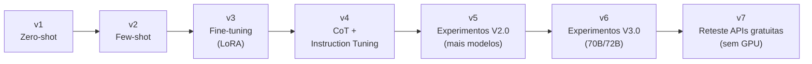
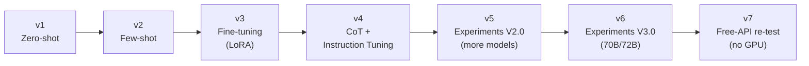

# Correção Automática de Redações do ENEM com LLMs

**Qwen 2.5 · Llama 3 · Mistral · Gemma 2 · LoRA · Python**

Correção automática de redações do ENEM com LLMs abertos, evoluindo de zero-shot até fine-tuning via LoRA, com geração de feedback formativo para o aluno em vez de só uma nota. Projeto de Iniciação Científica (UTFPR).

[Leia em inglês ↓](#english) · Dataset: essay-br · Adaptadores: Hugging Face Hub

---

## Português

### Sobre o projeto

O ENEM avalia redações em 5 competências (C1-C5), cada uma pontuada de 0 a 200. Fazer essa correção manualmente é caro e lento em escala. Este projeto investiga o quão bem LLMs abertos conseguem reproduzir essa nota e, mais importante, gerar um **feedback formativo** (não só uma nota, mas uma explicação do que o aluno pode melhorar).

O projeto testa diferentes modelos (Qwen, Llama, Mistral, Gemma2, em tamanhos de ~7B até 70B/72B parâmetros) e diferentes estratégias de *prompting* e *fine-tuning*, comparando a nota gerada pelo modelo com a nota humana de referência.

### Evolução dos experimentos

O projeto foi construído de forma incremental, cada etapa usando o aprendizado da anterior:

| Etapa | O que testa | Pasta |
|---|---|---|
| v1 (Zero-shot) | Modelos avaliando redação sem exemplo prévio | [`notebooks/v1_zero_shot`](notebooks/v1_zero_shot) |
| v2 (Few-shot) | Mesmos modelos, agora com exemplos no prompt | [`notebooks/v2_few_shot`](notebooks/v2_few_shot) |
| v3 (Fine-tuning com LoRA) | Ajuste fino dos modelos no dataset de redações via LoRA | [`notebooks/v3_finetuning`](notebooks/v3_finetuning) |
| v4 (CoT + Instruction Tuning) | *Chain-of-thought* e ajuste por instrução, geração de feedback formativo | [`notebooks/v4_cot_instruction_tuning`](notebooks/v4_cot_instruction_tuning) |
| v5 (Experimentos V2.0) | Re-execução consolidada de zero/few-shot com mais modelos (checkpoints por fold) | [`notebooks/v5_experimentos_v2`](notebooks/v5_experimentos_v2) |
| v6 (Experimentos V3.0) | Escala para modelos maiores (Llama 70B, Qwen 72B) | [`notebooks/v6_experimentos_v3`](notebooks/v6_experimentos_v3) |
| v7 (Reteste com APIs gratuitas) | Modelos hospedados gratuitos (Gemini Flash Lite, gpt-oss-120B), prompt por competência e calibração de escala | scripts na raiz + [`docs/log_experimentos.md`](docs/log_experimentos.md) |



#### Status atual

A etapa v6 (modelos de 70B/72B) foi interrompida no meio da execução por falta de crédito computacional no Google Colab Pro, por isso inclui uma tentativa adicional com vLLM (`exp_all_qwen72b_vllm_v3.ipynb`) como alternativa mais eficiente de inferência. Os notebooks dessa etapa refletem o estado real em que os experimentos pararam, não uma versão "limpa": optei por manter assim para documentar o processo real de pesquisa, não só o resultado final.

A etapa v7 abandona o fine-tuning local de modelos grandes e passa a usar modelos hospedados gratuitos, sem GPU. Três achados principais:

- **Boa parte do QWK baixo dos experimentos anteriores era erro de escala, não de julgamento.** Uma calibração de viés aprendida em folds separados por tema leva o melhor modelo de 7B de QWK 0,25 para 0,42, e é adotada como pós-processamento padrão.
- **Gemini 3.5 Flash Lite com prompt por competência (uma chamada por C1 a C5, com a rubrica no prompt), calibrado, chega a QWK 0,60** na nota total, avaliação cross-prompt. Esse é o piso da faixa publicada para o essay-br (0,60 a 0,73). O gpt-oss-120B aberto chega ao mesmo patamar do Flash Lite no modo holístico (~0,52), confirmando que não é particularidade de um modelo.
- **As competências C1 (norma culta) e C5 (proposta de intervenção) seguem sendo o gargalo** (QWK 0,29 e 0,33). Prompts dedicados com análise estruturada para essas duas competências foram testados e não melhoraram.

Ver a tabela datada de todos os testes e o estado das cotas das APIs em [`docs/log_experimentos.md`](docs/log_experimentos.md).

**Scripts da etapa v7** (rodam localmente, só `pandas` + `numpy` + `requests`):

| Script | O que faz |
|---|---|
| `evaluate.py` | Pacote de métricas por CSV de predição (MAE, RMSE, QWK total e por competência, Pearson, Spearman, acurácia adjacente, viés, matriz de confusão) |
| `calibrate.py` | Experimento de recalibração de escala, 5-fold por tema, out-of-fold e oráculo |
| `build_prompt_map.py` | Reconstrói o mapa redação para tema do conjunto de teste do v5 (validado contra os checkpoints) |
| `sample_testset.py` | Amostra fixa e estratificada de 300 redações |
| `run_api_scoring.py` | Cliente único para Gemini, Groq e Cerebras (endpoint compatível com OpenAI), modos `holistico`, `mts` e `mts2`, com retry, controle de rate limit e checkpoint por redação |
| `plot_progresso.py` | Gráfico da progressão do QWK e do QWK por competência |
| `verify_metrics.py` | Confere as métricas do `evaluate.py` contra scikit-learn e scipy |

### Metodologia

- **Dataset:** redações do ENEM anonimizadas (dataset [essay-br](https://github.com/lplnufpi/essay-br)), com nota de referência por competência (C1-C5) e nota final.
- **Validação:** k-fold cross-validation para avaliar consistência entre folds.
- **Ajuste de hiperparâmetros:** Optuna, para busca automática de configurações de fine-tuning.
- **Avaliação:** comparação nota-a-nota com referência humana, e BERTScore para qualidade textual do feedback gerado.
- **Fine-tuning:** LoRA (Low-Rank Adaptation) para ajuste eficiente dos modelos sem re-treinar todos os parâmetros.

### Tecnologias

Python · Jupyter/Google Colab · Hugging Face Transformers · PEFT (LoRA) · Optuna · BERTScore · Qwen 2.5 · Llama 3 · Mistral · Gemma 2

### Adaptadores LoRA (pesos dos modelos)

Os pesos dos modelos ajustados (LoRA adapters) não estão neste repositório por tamanho (200MB+ ao todo); a prática recomendada é publicá-los no Hugging Face Hub. As configurações usadas em cada fine-tuning (hiperparâmetros do LoRA) estão documentadas em [`docs/lora_configs`](docs/lora_configs).

Adaptadores publicados no Hugging Face Hub:
- [Qwen 2.5 (qwen-essay-scorer-lora)](https://huggingface.co/YurinhoMatsumoto/qwen-essay-scorer-lora)
- [Llama 3.1 (llama-essay-scorer-lora)](https://huggingface.co/YurinhoMatsumoto/llama-essay-scorer-lora)
- [Mistral (mistral-essay-scorer-lora)](https://huggingface.co/YurinhoMatsumoto/mistral-essay-scorer-lora)
- [Gemma 2 (gemma2-essay-scorer-lora)](https://huggingface.co/YurinhoMatsumoto/gemma2-essay-scorer-lora)

### Estrutura do repositório

```
notebooks/   > um notebook por etapa do experimento (v1 a v6)
results/     > gráficos e CSVs de resultado de cada etapa
data/        > dataset usado nos experimentos de feedback (v4)
docs/        > configurações dos adaptadores LoRA e referências bibliográficas
```

### Colaboração

Projeto desenvolvido por Yuri Matsumoto, com colaboração de Mônica em parte dos experimentos de CoT/instruction tuning (v4).

### Referências

Ver [`docs/referencias.md`](docs/referencias.md) para a lista de artigos que embasaram a metodologia.

---

## English

### About the project

The ENEM exam scores essays across 5 competencies (C1-C5), each rated 0-200. Manual grading at scale is slow and expensive. This project investigates how well open LLMs can reproduce that score and, more importantly, generate **formative feedback** (not just a grade, but an explanation of what the student can improve).

The project evaluates multiple models (Qwen, Llama, Mistral, Gemma2, ranging from ~7B to 70B/72B parameters) and multiple prompting/fine-tuning strategies, comparing model-generated scores against human reference scores.

### Experiment evolution

| Stage | What it tests | Folder |
|---|---|---|
| v1 (Zero-shot) | Models scoring essays with no prior example | [`notebooks/v1_zero_shot`](notebooks/v1_zero_shot) |
| v2 (Few-shot) | Same models, now with examples in the prompt | [`notebooks/v2_few_shot`](notebooks/v2_few_shot) |
| v3 (Fine-tuning with LoRA) | Fine-tuning models on the essay dataset via LoRA | [`notebooks/v3_finetuning`](notebooks/v3_finetuning) |
| v4 (CoT + Instruction Tuning) | Chain-of-thought and instruction tuning, formative feedback generation | [`notebooks/v4_cot_instruction_tuning`](notebooks/v4_cot_instruction_tuning) |
| v5 (Experiments V2.0) | Consolidated re-run of zero/few-shot with more models (per-fold checkpoints) | [`notebooks/v5_experimentos_v2`](notebooks/v5_experimentos_v2) |
| v6 (Experiments V3.0) | Scaling up to larger models (Llama 70B, Qwen 72B) | [`notebooks/v6_experimentos_v3`](notebooks/v6_experimentos_v3) |
| v7 (Free-API re-test) | Free hosted models (Gemini Flash Lite, gpt-oss-120B), trait-specific prompting and scale calibration | scripts at repo root + [`docs/log_experimentos.md`](docs/log_experimentos.md) |



#### Current status

Stage v6 (70B/72B models) was interrupted mid-run when Google Colab Pro compute credits ran out, which is why it also includes an additional attempt using vLLM (`exp_all_qwen72b_vllm_v3.ipynb`) as a more efficient inference alternative. Notebooks in this stage reflect the actual state the experiments stopped at, not a "cleaned up" version: kept this way intentionally to document the real research process, not just the final result.

Stage v7 drops local fine-tuning of large models and moves to free hosted models, no GPU. Three main findings:

- **Much of the low QWK in earlier experiments was a scale error, not a judgment error.** A bias calibration learned on prompt-disjoint folds takes the best 7B model from QWK 0.25 to 0.42, and is adopted as standard post-processing.
- **Gemini 3.5 Flash Lite with trait-specific prompting (one call per C1-C5, rubric in the prompt), calibrated, reaches QWK 0.60** on the total score, cross-prompt. That is the floor of the published range for essay-br (0.60 to 0.73). The open gpt-oss-120B reaches the same level as Flash Lite in holistic mode (~0.52), confirming this is not model-specific.
- **Competencies C1 (formal register) and C5 (intervention proposal) remain the bottleneck** (QWK 0.29 and 0.33). Dedicated prompts with structured analysis for these two competencies were tested and did not help.

See the dated table of all tests and the API quota state in [`docs/log_experimentos.md`](docs/log_experimentos.md).

**Stage v7 scripts** (run locally, only `pandas` + `numpy` + `requests`): `evaluate.py` (metric suite), `calibrate.py` (scale-recalibration experiment, 5-fold by prompt), `build_prompt_map.py` (rebuilds the essay-to-prompt map for the v5 test set), `sample_testset.py` (fixed stratified 300-essay sample), `run_api_scoring.py` (single client for Gemini/Groq/Cerebras via OpenAI-compatible endpoint; `holistico`, `mts`, `mts2` modes; retry, rate-limit control, per-essay checkpoint), `plot_progresso.py` (QWK progression chart), `verify_metrics.py` (checks `evaluate.py` against scikit-learn and scipy).

### Methodology

- **Dataset:** anonymized ENEM essays ([essay-br](https://github.com/lplnufpi/essay-br) dataset), with reference scores per competency (C1-C5) and final score.
- **Validation:** k-fold cross-validation to assess consistency across folds.
- **Hyperparameter tuning:** Optuna, for automated fine-tuning configuration search.
- **Evaluation:** score-by-score comparison against human reference, and BERTScore for generated feedback text quality.
- **Fine-tuning:** LoRA (Low-Rank Adaptation) for efficient adaptation without retraining all parameters.

### Tech stack

Python · Jupyter/Google Colab · Hugging Face Transformers · PEFT (LoRA) · Optuna · BERTScore · Qwen 2.5 · Llama 3 · Mistral · Gemma 2

### LoRA adapters (model weights)

Fine-tuned model weights (LoRA adapters) are not included in this repository due to size (200MB+ combined); the recommended practice is publishing them on the Hugging Face Hub instead. The configuration used for each fine-tuning run (LoRA hyperparameters) is documented under [`docs/lora_configs`](docs/lora_configs).

Adapters published on the Hugging Face Hub:
- [Qwen 2.5 (qwen-essay-scorer-lora)](https://huggingface.co/YurinhoMatsumoto/qwen-essay-scorer-lora)
- [Llama 3.1 (llama-essay-scorer-lora)](https://huggingface.co/YurinhoMatsumoto/llama-essay-scorer-lora)
- [Mistral (mistral-essay-scorer-lora)](https://huggingface.co/YurinhoMatsumoto/mistral-essay-scorer-lora)
- [Gemma 2 (gemma2-essay-scorer-lora)](https://huggingface.co/YurinhoMatsumoto/gemma2-essay-scorer-lora)

### Repository structure

```
notebooks/   > one notebook per experiment stage (v1 to v6)
results/     > charts and result CSVs for each stage
data/        > dataset used in the feedback experiments (v4)
docs/        > LoRA adapter configs and bibliography
```

### Collaboration

Developed by Yuri Matsumoto, with Mônica collaborating on part of the CoT/instruction tuning experiments (v4).

### References

See [`docs/referencias.md`](docs/referencias.md) for the list of papers that informed the methodology.
